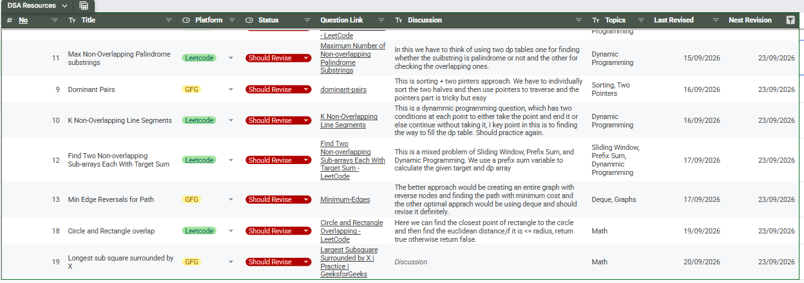

# DSA AutoTracker 🚀

A Chrome Extension that helps automate DSA problem tracking.

DSA AutoTracker detects the problem you're currently solving on **LeetCode** or **GeeksforGeeks** and allows you to save the problem details directly into your Google Sheet.

Instead of manually maintaining a DSA revision sheet, the extension automatically captures the problem metadata and lets you enter your own intuition, topics, revision status, and revision dates.

---

## ✨ Features

- Automatically detects the current platform
  - LeetCode
  - GeeksforGeeks
- Automatically detects the problem title
- Automatically captures the problem URL
- Add your own problem intuition
- Add DSA topics
- Track revision status
- Set your own last revision date
- Set your own next revision date
- Save problems directly to Google Sheets
- Uses Google Apps Script as the backend

---

# 🏗️ Architecture

```text
                    LeetCode / GFG
                          │
                          ▼
                 Chrome Content Script
                          │
                          ▼
                   Extension Popup
                          │
                          │ HTTP POST
                          ▼
                  Google Apps Script
                          │
                          ▼
                     Google Sheet

```

# Google Apps Script Backend Setup

DSA AutoTracker uses **Google Apps Script** as a small backend between the Chrome extension and your Google Sheet.

The flow is:

```text
Chrome Extension
       │
       │ POST request
       ▼
Google Apps Script
       │
       │ doPost(e)
       ▼
Google Sheet

```
## 2. Create Your Google Sheet

Create a new Google Sheet that you want to use for tracking your DSA problems.

The sheet should contain the following columns:

- No
- Title
- Platform
- Status
- Question Link
- Discussion
- Topics
- Last Revised
- Next Revision

Your Google Sheet should look similar to the following:



> **Note:** The data shown in the screenshot is only an example. You can start with an empty sheet containing the same column headers.

### Required Column Structure

| Column | Purpose |
|---|---|
| No | Automatically generated problem number |
| Title | Problem title |
| Platform | LeetCode / GFG |
| Status | Revision status |
| Question Link | Link to the original problem |
| Discussion | Your intuition/thought process |
| Topics | DSA topics related to the problem |
| Last Revised | Date you last revised the problem |
| Next Revision | Date you want to revise it again |
